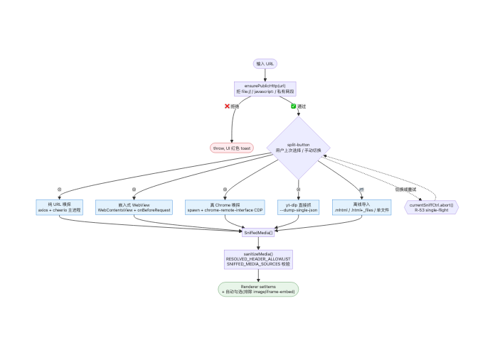
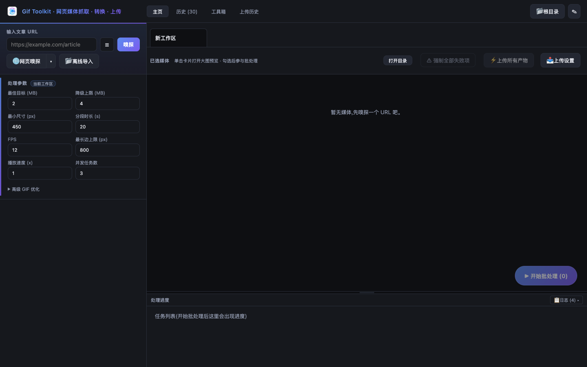
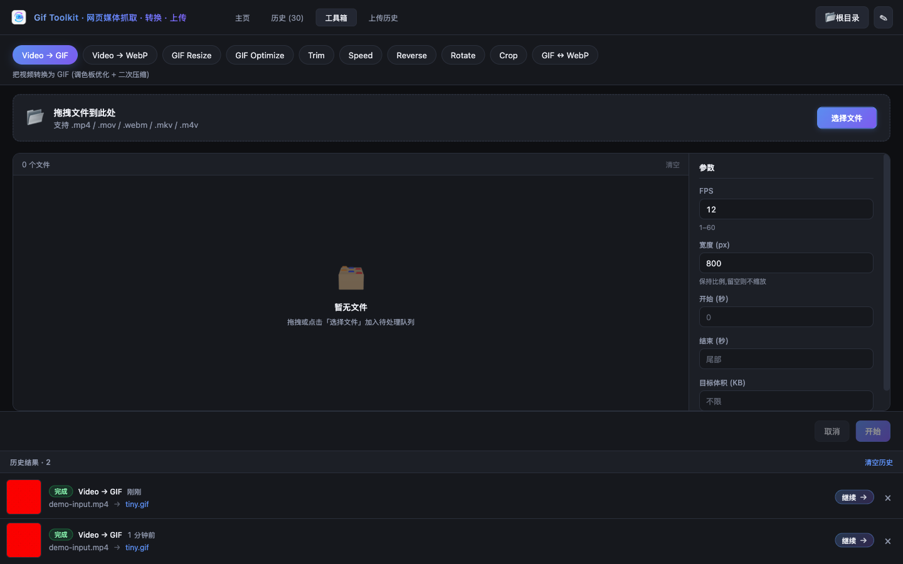
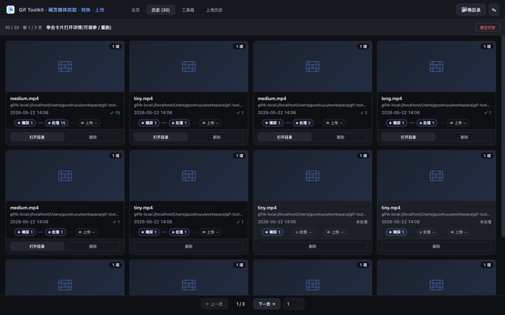
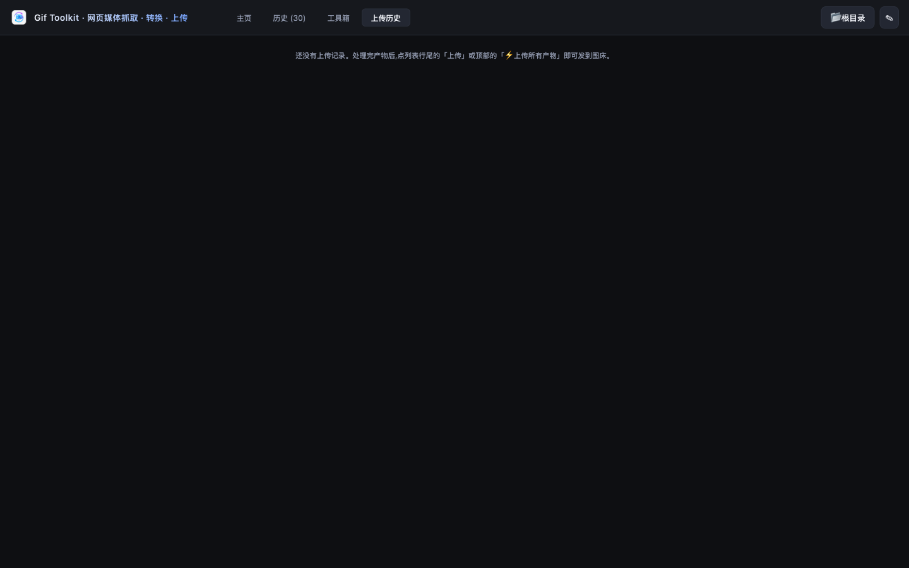
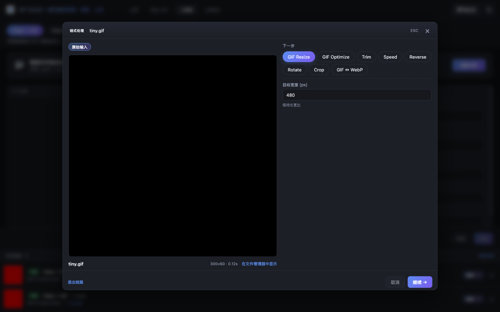
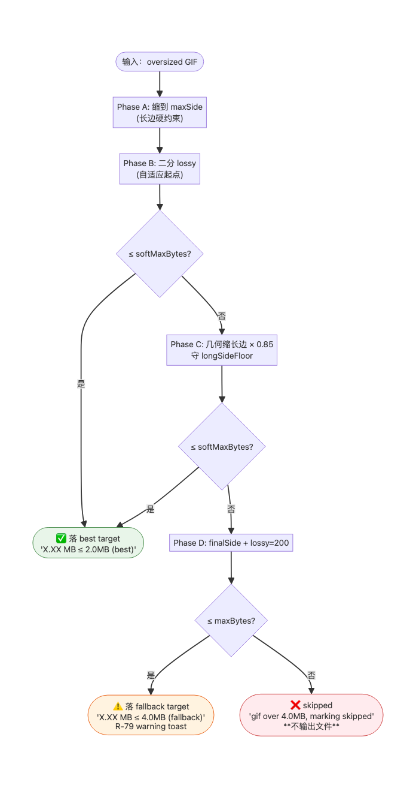
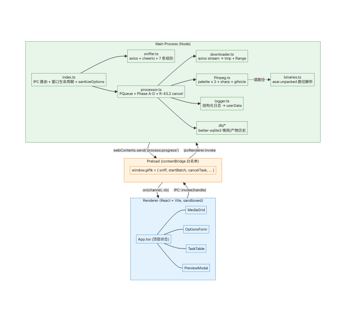
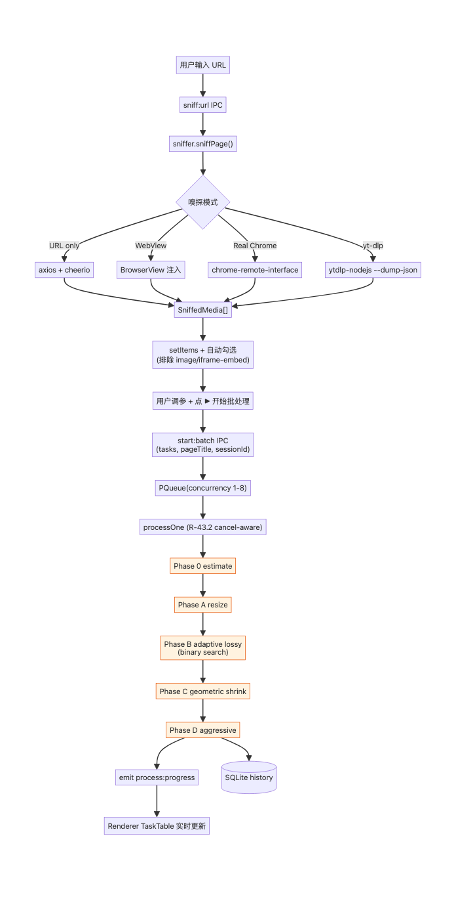
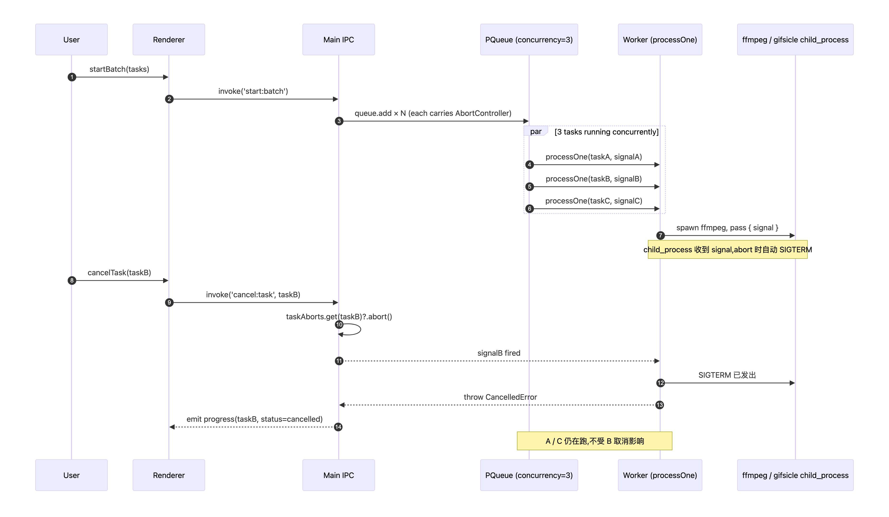

<p align="center">
  
</p>

<h1 align="center">Gif Toolkit</h1>

<p align="center">
  <b>A local, cross-platform desktop app that turns "fetch web media → trim → convert to GIF / WebP → fit the platform's hard limit → grab a Markdown link" into just a few clicks. Nothing leaves your machine.</b>
</p>

<p align="center">
  <b>English</b> · <a href="./README.md">简体中文</a>
  <br/><br/>
  
  
  
  
  
</p>

---

## What is this

Anyone who ships GIFs into Slack, Discord, X, blogs or WeChat hits the same wall: **every platform has its own hard caps** (WeChat 10 MB AND <= 300 frames, Weibo 5 MB, Discord 8 MB, Slack 5 MB ...). Hand-tuning side length, fps and palette every time is tedious and never reproducible.

Gif Toolkit automates the whole pipeline:

- Paste an article URL and **auto-sniff** every GIF / video / embed inside (Bilibili / YouTube / X / TikTok / Instagram, ...)
- **Convert video → GIF / WebP** with a two-pass palette + Lanczos scaling + Bayer dithering — quality stays predictable
- **Four-phase adaptive compression** lands the output between your "soft target" and "hard target" — never silently emits an over-budget file
- One-click upload to your own host / GitHub / Qiniu / Aliyun OSS / Tencent COS, **auto-generates a Markdown link** ready to paste

Everything runs locally. **Offline-friendly, no login, nothing sent to any third-party server.**

---

## Three pains you have probably hit

### 1. "Video → GIF" is either blurry or huge

`ffmpeg -i x.mp4 out.gif` ships output that is either unreadable text, or 30 MB. Hand-tuning `palettegen / paletteuse / lossy` a few times and most people give up.

> Gif Toolkit gives you **two-pass palette + binary-search lossy** out of the box, aiming to land **exactly** on your target size. Hits the target, stop. Misses, geometrically shrink the long side. Still misses, mark `skipped`. **It will never quietly hand you an over-budget file.**

### 2. WeChat's invisible 300-frame cap

WeChat's editor enforces two unrelated hard caps on GIFs: **frame count <= 300** and a **clean header** (no diff-frame / comment / offset frame). Counter-intuitively, `gifsicle -O3` adds diff-frames back. So "I compressed it to 1 MB and WeChat still rejects it" is a trap nearly everyone runs into once.

> Gif Toolkit ships a dedicated **WeChat-safe sanitize sub-pipeline**: gifsicle probe → ffmpeg `-gifflags -transdiff-offsetting` full re-encode → gifsicle `-O0 --no-extensions --no-comments --lossy=80`. Output has frames <= 300, variants=1, offset=0 — **drops straight into WeChat's editor**.

### 3. Sniffing fails — JS, login walls, Cloudflare ...

Plain `axios + cheerio` cannot reach pages that need JS rendering, login cookies, or pages gated by Cloudflare's JA3 fingerprinting. Those sites happen to be the richest sources of animated content.

> Gif Toolkit offers a **5-tier sniffer cascade**, ramping up only when needed:
>
> 
>
> No matter how locked down the page is, one of the tiers usually gets you the direct URL.

---

## Screenshots

<table>
  <tr>
    <td width="50%"></td>
    <td width="50%"></td>
  </tr>
  <tr>
    <td align="center"><sub><b>Home</b> · paste URL → sniff → tick → batch</sub></td>
    <td align="center"><sub><b>Toolbox</b> · 10 standalone tools, drop a file and go</sub></td>
  </tr>
  <tr>
    <td width="50%"></td>
    <td width="50%"></td>
  </tr>
  <tr>
    <td align="center"><sub><b>History</b> · every sniff / output / log archived</sub></td>
    <td align="center"><sub><b>Uploads</b> · 5 hosts + hash dedup + Markdown</sub></td>
  </tr>
</table>

---

## Quickstart

### Three steps

```bash
git clone <repo-url>
cd gif-toolkit
npm install     # auto-prepares ffmpeg / gifsicle / sharp / yt-dlp
npm run dev     # main + renderer with hot reload
```

After the app launches:

1. Paste a page URL (any page with GIFs / videos / embeds) into the address bar and click **Sniff**
2. Tick what you want from the media grid; tweak `softMaxBytes` / `maxWidth` / `fps` / `colors`
3. Click **Run batch**, wait for the task table; switch to the **Uploads** tab to push to a host and copy the Markdown link

### Packaging

```bash
npm run package:mac     # macOS: dmg + zip (Intel + Apple Silicon)
npm run package:win     # Windows: NSIS x64
npm run package:linux   # Linux: AppImage / deb / tar.gz
```

> No Apple notarization / Authenticode / Linux code signing yet. First launch may show "unidentified developer" — the app surfaces a toast with right-click-open / SmartScreen-skip instructions.

---

## Toolbox (10 standalone tools)

The **Toolbox** tab exposes 10 standalone tools, each accepting drag-and-dropped local files for batch use:

| Tool | Purpose |
| --- | --- |
| Video → GIF | Video to GIF + adaptive compression |
| Video → WebP | Video to animated WebP |
| GIF Resize | Proportional width scaling |
| GIF Optimize | gifsicle `-O3` / lossy / colors / dither |
| GIF WeChat-safe | 3-step sanitize, output drops straight into WeChat (<= 300 frames / clean header) |
| Trim | Lossless time-range cutting |
| Speed | 0.25x ~ 4x speed change |
| Reverse | Reverse playback |
| Rotate | Rotate + flip |
| Crop | Visual rectangular crop |
| GIF ↔ WebP | Convert between the two animation formats |

### Progressive lineage chain (R-TB-CHAIN-V2.6 — modal overlay + autoplay preview)

Every done row in the toolbox history sidebar shows a **「继续 →」(Continue →)** button (aria-label is still `继续处理`). Clicking it pops up a **dedicated lineage modal overlay** seeded with that artifact as the root node — the batch UI stays mounted underneath, just behind the dimmed mask. A linear breadcrumb at the top tracks every step (`Original input → GIF Resize → GIF Optimize ...`); the centre of the modal hosts an **auto-playing preview** of the current artifact — `.gif/.webp` use `` (browsers loop animated image formats natively), `.mp4/.mov/.webm/...` use `<video muted autoplay loop playsInline>` (Chromium allows muted autoplay without a user gesture). Below: chips filtered by the focused artifact's extension (a `.gif` focus hides `Video → GIF`), the per-kind ParamForm, and a footer with `退出链路 / 取消 / 继续 →`. Clicking an earlier breadcrumb segment walks focus back so you can branch from a historical step. ESC / mask click / **「退出链路」(Exit chain)** all close the modal without dropping the lineage — re-entering through any history row picks up where you left off.

History rows have been upgraded to a 4-col grid: a 56×56 thumbnail on the left (static first-frame poster by default; **hover** swaps the `` src to a `giftk-local://` URL so animated GIF/WebP plays live during hover) + status/kind/time meta + a compact **「继续 →」** pill + remove.



Each step is a single-step `startToolboxChain` IPC, reusing the existing chain runner, cancellation propagation, and history contract (see [docs/ipc-contract.md](./docs/ipc-contract.md) and SUITE TB-CHAIN A/B/C/D/E). Crop in lineage mode reuses the batch CropForm and writes the rect directly into draft params; the legacy `awaiting-input` pause model is no longer triggered from the renderer.

---

## Adaptive compression pipeline (why outputs are stable)

Four-phase progressive strategy; on average about 12 gifsicle calls land the target size:



1. **Resize first** — bring the long side down to `maxWidth` (often enough on its own)
2. **Adaptive lossy** — binary-search lossy in `[0, 200]`, aim for `softMaxBytes` (default 2 MB)
3. **Geometric shrink** — guard `minSize` short-side floor, multiply long side by 0.85 repeatedly
4. **Hard fallback** — if still > `maxBytes` (default 4 MB), mark `skipped`. **Never emit an over-budget file.**

> Full state machine, hit conditions and emit-signal contract: see [docs/compression-pipeline.md](./docs/compression-pipeline.md). The WeChat-safe sub-pipeline is documented in section 8 of the same doc.

Tunables: `maxBytes` / `softMaxBytes` / `maxWidth` / `minSize` / `fps` / `colors` / `concurrency` / `maxSegmentSec`. Built-in presets for WeChat / Zhihu / Weibo etc.

---

## Five-tier sniffer cascade (why fetching works)

| Tier | Implementation | Suits |
| --- | --- | --- |
| (1) URL sniff | main process axios + cheerio | Plain blogs / news / direct links / `og:video` exposed |
| (2) Embedded WebView | `WebContentsView` + `webRequest.onBeforeRequest` | Sites needing login / cookies / OAuth / light interaction |
| (3) Real Chrome sniff | spawn local Chrome / Edge / Brave + chrome-remote-interface (CDP) | Cloudflare / JA3-gated sites |
| (4) yt-dlp direct | ytdlp-nodejs `--dump-single-json` | 1900+ video sites (Bilibili / YouTube / X / TikTok / Instagram ...) |
| (5) Offline import | `.mhtml` / `.html + _files/` / single file / drag drop | Site is dead / network is down / page already saved |

> Sniffer rules, dedupKey algorithm and embed-provider list: see [docs/sniffer-cascade.md](./docs/sniffer-cascade.md) and [docs/sniffer-rules.md](./docs/sniffer-rules.md).

---

## Image hosting

5 backends built in, configurable, multiple per backend:

- **Self-hosted Web** (custom signed endpoint)
- **GitHub Contents API**
- **Qiniu Kodo**
- **Aliyun OSS**
- **Tencent COS**

File-hash dedup with 30-day TTL — same file hits the cache and reuses the remote URL, saving bandwidth and quota. Markdown links are auto-generated and one-click copyable. **Tokens / secrets are masked everywhere and never written to logs.**

---

## Cross-platform

| Capability | macOS | Windows | Linux |
| --- | --- | --- | --- |
| Installer | dmg / zip (Intel + Apple Silicon) | NSIS x64 | AppImage / deb / tar.gz (x64 + arm64) |
| FFmpeg / Sharp / yt-dlp | Yes | Yes | Yes (armv7 / Alpine musl is on you) |
| Real-Chrome sniff | Chrome / Canary / Edge / Brave / Chromium | Program Files / per-user paths | Snap / Flatpak / .deb / .rpm |
| Capability probing | Yes | Yes | Yes |
| App Icon | `.icns` (10-tier iconset) | `.ico` (7-tier) | `.png` 8 sizes |

> The icon pipeline uses Apple HIG's 824 / 1024 safe area + squircle rounding. All distribution artefacts are produced from a single source by [scripts/normalize-app-icon.mjs](./scripts/normalize-app-icon.mjs) with **zero new npm dependencies**. See [docs/architecture.md § 8](./docs/architecture.md).

---

## Stack

| Layer | Tech |
| --- | --- |
| Framework | Electron 31 + React 18 + TypeScript 5 + Vite 5 |
| Fetching | axios + cheerio (main process, bypassing CORS) + chrome-remote-interface (CDP) |
| Video processing | ffmpeg-static + ffprobe-static + sharp 0.33 |
| GIF optimization | gifsicle 5.3 |
| Direct-link extraction | yt-dlp (bundled, Unlicense) |
| Persistence | better-sqlite3 |
| Queue | p-queue (default concurrency 3, configurable 1–8) |
| Tests | vitest + happy-dom + @testing-library/react + playwright (e2e) |

---

## Architecture portal

Process topology (Renderer ↔ Preload ↔ Main):



End-to-end data flow (URL → sniff → 4-Phase compression → output):



Concurrency and cancellation propagation (per-task `AbortController`, signal threaded down to ffmpeg child processes):



> Every architecture diagram is a derived PNG generated from a mermaid block. To change a diagram, edit the mermaid block in [docs/architecture.md](./docs/architecture.md) / [docs/compression-pipeline.md](./docs/compression-pipeline.md) / [docs/sniffer-cascade.md](./docs/sniffer-cascade.md), then run `npm run docs:render`.

---

## Security & privacy

- `contextIsolation=true` / `nodeIntegration=false` — the renderer has **zero** Node capability
- Only whitelisted IPC is exposed; all download / parse / encode / upload happens in the main process
- Any URL is processed **locally only** and **never sent to any third-party server**
- yt-dlp passes through only an allow-listed header set (User-Agent / Referer / Origin / Range, ...) — Authorization / Cookie are explicitly **not** forwarded; signed URLs and tokens are auto-masked before anything is logged
- Image-host tokens / secrets render as `••••••` with masked-merge in the UI; persisted as a separately encrypted field; **never enter logs**

---

## FAQ

**Q: Why can't I sniff a particular video URL?**
A: The site is probably TLS-fingerprinting / cookie-checking. Switch to the "Real Chrome sniff" tier and tick "use my real Chrome profile" so Cloudflare etc. recognise you as a normal user.

**Q: Some GIFs still exceed my target after compression. What now?**
A: The tool marks them `skipped` instead of emitting an oversized file. Either raise `maxBytes`, or hand-tune lossy / colors more aggressively in the Toolbox.

**Q: WeChat still says "image failed to load"?**
A: Run **GIF WeChat-safe** in the Toolbox. It forces a full re-encode with `-transdiff-offsetting` and uses `gifsicle -O0`. Full reasoning in [docs/compression-pipeline.md § 8](./docs/compression-pipeline.md).

**Q: Does it work offline?**
A: Yes. yt-dlp / ffmpeg / gifsicle / sharp are all bundled. The only step that requires network is "sniff a live URL".

**Q: Will GitHub treat uploaded images as code?**
A: No. The GitHub Contents API returns raw URLs you embed in Markdown. They are unrelated to your code commits.

---

## Documentation

For developers / contributors:

- [Architecture overview](./docs/architecture.md) — process topology, data flow, IPC sequence, 4-Phase state machine, cross-platform icon pipeline, concurrency / cancellation
- [Compression pipeline](./docs/compression-pipeline.md) — 4-Phase hit conditions, emit signals, WeChat-safe sub-pipeline
- [Sniffer cascade](./docs/sniffer-cascade.md) — full cascade diagram + per-tier engineering notes
- [Sniffer rules](./docs/sniffer-rules.md)
- [yt-dlp embed resolver](./docs/embed-resolver.md)
- [IPC contract](./docs/ipc-contract.md)
- [Troubleshooting](./docs/troubleshooting.md)
- [SQLite persistence and native ABI](./docs/R-80-SQLITE-NOTES.md)

Engineering discipline (rules / scenarios / checklists): see [harness/](./harness/).
Submission rules for new features and bug fixes: see [AGENTS.md](./AGENTS.md).

---

## Contributing

Issues and PRs welcome. Before submitting please read:

1. [AGENTS.md](./AGENTS.md) — project-level hard rules
2. [harness/checklists/pr-checklist.md](./harness/checklists/pr-checklist.md) — pre-submit self-check
3. [harness/scenarios/](./harness/scenarios/) — already-captured regression scenarios

Every new feature / bug fix must ship with tests.

---

## Acknowledgements

- [ezgif.com](https://ezgif.com/) — original feature & UX reference
- [yt-dlp](https://github.com/yt-dlp/yt-dlp) — de-facto standard for direct-link extraction
- [ffmpeg](https://ffmpeg.org/) / [gifsicle](https://www.lcdf.org/gifsicle/) / [sharp](https://sharp.pixelplumbing.com/) — the three pillars of video & GIF processing

---

## License

MIT
