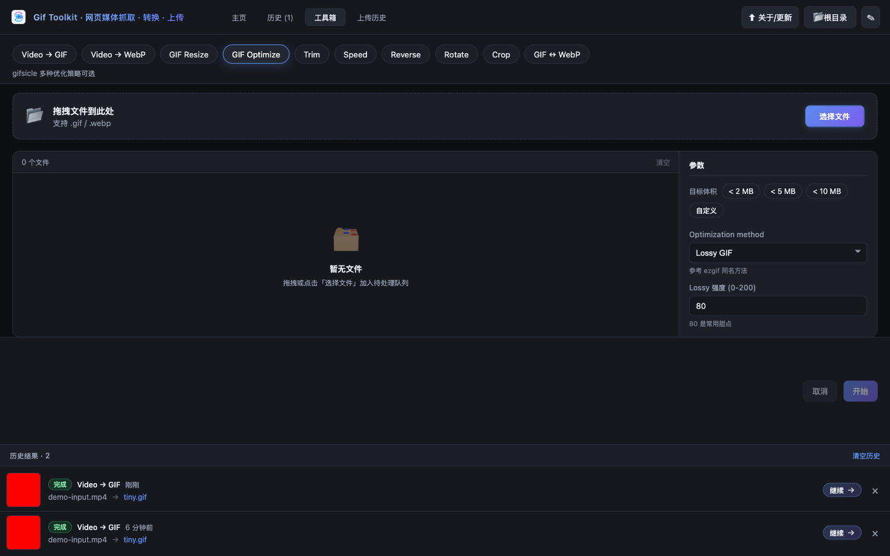
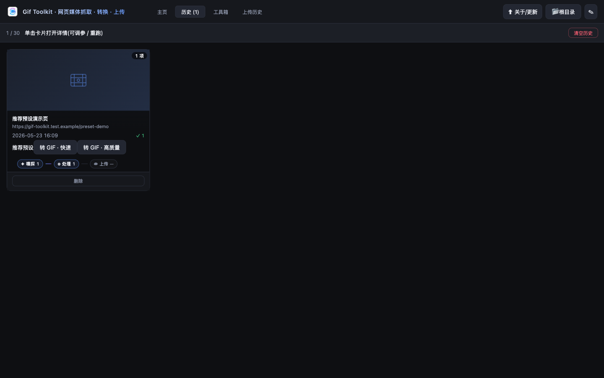

<p align="center">
  
</p>

<h1 align="center">Gif Toolkit</h1>

<p align="center">
  <b>把"扒下网页里的视频 / GIF → 压到平台限额 → 拿 Markdown 链接"做成几次点击。</b>
  <br/>
  本地、跨平台、不上传任何数据，离线可用。
</p>

<p align="center">
  <a href="./README.en.md">English</a> · <b>简体中文</b>
  <br/><br/>
  
  
  
  
  
</p>

---

## 它解决什么

写公众号、写技术博客、在 Slack & Discord 发动图，老是要面对各家平台的硬限：公众号 ≤ 10 MB 还要 ≤ 300 帧、微博 ≤ 5 MB、Discord ≤ 8 MB……手动调 ffmpeg / gifsicle 反复试，很无聊也出不来稳定结果。

Gif Toolkit 把整条链路自动化：

- 给一个文章 URL，**自动嗅探**里面所有 GIF / 视频 / 嵌入式播放器（Bilibili / YouTube / X / TikTok / Instagram 等）。
- **视频转 GIF / WebP**，两遍调色板 + Lanczos + Bayer 抖动，质量稳得住。
- **四阶段自适应压缩**自动命中你设的"软目标 / 硬目标"，绝不输出超规格的垃圾文件。
- 一键上传到自建图床 / GitHub / 七牛 / OSS / COS，**自动生成 Markdown 链接**直接贴进文章。

整个过程全部在本地跑，**离线可用，无登录，不发任何数据到第三方服务器**。

---

## 界面预览

<table>
  <tr>
    <td width="50%"></td>
    <td width="50%"></td>
  </tr>
  <tr>
    <td align="center"><sub><b>主页</b> · 粘 URL → 嗅探 → 勾选 → 批处理</sub></td>
    <td align="center"><sub><b>工具箱</b> · 10 个独立工具，拖文件就能跑</sub></td>
  </tr>
  <tr>
    <td width="50%"></td>
    <td width="50%"></td>
  </tr>
  <tr>
    <td align="center"><sub><b>历史</b> · 嗅探 / 产物 / 操作日志全留底</sub></td>
    <td align="center"><sub><b>上传历史</b> · 5 种图床 + 哈希去重 + Markdown</sub></td>
  </tr>
</table>

---

## 快速开始

```bash
git clone <repo-url>
cd gif-toolkit
npm install     # 自动准备 ffmpeg / gifsicle / sharp / yt-dlp
npm run dev     # 启动 App
```

打开 App 之后：

1. 顶部地址栏粘贴一个含 GIF / 视频的页面 URL，点 **开始嗅探**。
2. 在媒体网格里勾选要的文件，按需调参（或直接用平台预设）。
3. 点 **开始批处理**，等任务表跑完；到「上传历史」一键上传 + 复制 Markdown 链接。

### 打包

```bash
npm run package:mac     # macOS：dmg + zip（Intel + Apple Silicon）
npm run package:win     # Windows：NSIS x64
npm run package:linux   # Linux：AppImage / deb / tar.gz
```

> 启动 5 秒会静默查询 GitHub Releases；发现严格更高的稳定版本会弹「检查更新」对话框。也可在右上「⬆ 关于/更新」/ 托盘 / macOS 应用菜单手动触发。

---

## 安装与首次启动（无法打开怎么办）

Gif Toolkit 当前**没有配置 Apple 公证（notarization） / Windows Authenticode / Linux 代码签名**——签名是收费的法律义务，对一个 MIT 个人项目来说性价比太低。所以三大系统在第一次打开时都会有一道「这是不是恶意软件」的拦截。**这是预期行为，不是 bug**，按下面操作放行即可。

### 🍎 macOS

#### 症状

弹窗写：

> **"Gif Toolkit" is damaged and can't be opened. You should move it to the Trash.**
>
> "Gif Toolkit"已损坏，无法打开。你应该将它移到废纸篓。

⚠️ **不要点 "Move to Trash"**。这不是 App 真的坏了，是 Safari / Chrome 给下载文件打的 `com.apple.quarantine` 扩展属性，被 macOS Gatekeeper 拦死了。

#### 解决

打开「终端」（`/Applications/Utilities/Terminal.app` 或聚焦搜索 Terminal），运行：

```bash
xattr -cr "/Applications/Gif Toolkit.app"
```

> 如果 dmg 还没拖到 Applications，先拖过去再跑这行。

然后正常双击打开即可。第一次启动可能再弹一次「未知开发者」对话框，按一次 **「打开」/ Open** 就过了，以后都不会再问。

#### 原理

`xattr -cr` 是 **clear recursive**：把 App bundle 内所有文件的所有扩展属性清掉，包括 `com.apple.quarantine`。等价于 macOS 把这个 App 当作"不是从浏览器下载的"。**不会修改 App 内容本身**。

#### 已经试过"右键打开"但仍然不行？

老教程经常告诉你「右键 App → 打开 → 在弹窗点打开」就能放行——这套路在 **macOS Sonoma (14.x) 之前**还有效。从 **macOS Sequoia (15.0+)** 起 Apple 收紧了 Gatekeeper：

| 系统版本 | 表现 | 通路 |
| --- | --- | --- |
| macOS ≤ 14.x | 弹「未识别开发者」灰按钮 | 右键 → 打开 → 确认 ✅ |
| macOS 15.0 | 直接弹 "is damaged" | 右键失效；要去**系统设置 → 隐私与安全性**最底部点「仍要打开」 |
| macOS 15.1+ | 直接弹 "is damaged" | 右键 + 系统设置都不再出现放行按钮，**只能用 `xattr -cr`** |

所以「右键打不开」是 Apple 的设计，**不是 App 本身坏了**。新版 macOS 上 `xattr -cr "/Applications/Gif Toolkit.app"` 是唯一稳定的解法。

#### 备选：从「系统设置」放行（仅 macOS 15.0 有效）

1. 双击 App → 看到 "is damaged" → 点 **Cancel**（**千万别点 Move to Trash**）。
2. 打开「系统设置」 → 「隐私与安全性」。
3. 滚到最下面，找到 `"Gif Toolkit" was blocked ...`，点旁边的 **仍要打开 / Open Anyway**。
4. 输 Touch ID / 密码确认，再双击 App 即可。

如果第 3 步看不到那行提示，说明你的系统是 15.1+，请直接用 `xattr -cr` 那一条命令。

---

### 🪟 Windows

#### 症状

双击 `Gif-Toolkit-1.0.0-win-x64.exe` 时蓝底大字：

> **Windows protected your PC**
>
> Microsoft Defender SmartScreen prevented an unrecognized app from starting. Running this app might put your PC at risk.

#### 解决

1. 在弹窗里点 **More info**（更多信息）。
2. 出现新的按钮 **Run anyway**（仍要运行），点它。
3. NSIS 安装器正常启动，按提示装到 `C:\GifToolkit` 即可。

> SmartScreen 是看「下载量 + 数字签名」的可信度评分。一个新发布的 unsigned 安装器评分是 0，跑得多了反而会自然被洗白。

#### 如果 360 / 火绒 / Defender 直接删了 exe

部分国产杀软对 unsigned 安装器有更激进的策略。请到杀软的「隔离区 / 信任区」里把它**恢复并加入白名单**，或临时关闭实时保护后再装一次。安装完成后可以重新打开实时保护，已装的可执行文件不会再被打扰。

---

### 🐧 Linux

按你下载的格式不同，操作不同：

#### AppImage（推荐，免安装绿色版）

```bash
chmod +x Gif-Toolkit-1.0.0-linux-x86_64.AppImage
./Gif-Toolkit-1.0.0-linux-x86_64.AppImage
```

如果报错 `dlopen(): error loading libfuse.so.2`：AppImage 依赖 FUSE 2，部分新版发行版（Ubuntu 22.04+ / Fedora 36+）默认只有 FUSE 3。装上兼容包：

```bash
# Debian / Ubuntu
sudo apt install libfuse2

# Fedora
sudo dnf install fuse-libs

# Arch
sudo pacman -S fuse2
```

#### .deb（Debian / Ubuntu）

```bash
sudo apt install ./Gif-Toolkit-1.0.0-linux-amd64.deb
# 之后从应用菜单或：
gif-toolkit
```

#### .tar.gz（任意发行版）

```bash
tar -xzf Gif-Toolkit-1.0.0-linux-x64.tar.gz
cd gif-toolkit-1.0.0
./gif-toolkit
```

#### 沙箱报错 `SUID sandbox helper binary was found, but is not configured correctly`

少数发行版（含部分 Ubuntu 24.04 配置）会因为内核 user namespace 限制导致 Electron 沙箱启动不了。**临时**绕过：

```bash
./Gif-Toolkit-1.0.0-linux-x86_64.AppImage --no-sandbox
```

> ⚠️ `--no-sandbox` 会牺牲一层渲染进程隔离，仅作 troubleshooting 使用。长期建议升级内核或用 `.deb` 安装版（系统会正确处理 SUID 权限）。

---

### 为什么不直接签名？

| 平台 | 一年成本（USD） | 备注 |
| --- | --- | --- |
| Apple Developer Program（公证） | $99 | 必须美元信用卡 + 全球唯一 Team ID |
| Authenticode（OV 证书） | ~$200 | 需要营业执照核验；EV 证书要 $300+ 还要 USB 硬件 token |
| Linux | 免费但生态分裂 | 各发行版对包签名要求都不一样 |

对一个 MIT 开源项目来说，**让用户多敲一行命令** 比 **替每个签名厂打钱** 是更合理的权衡。如果未来项目有公司主体或赞助，会优先把 macOS 公证补上（用户体验提升最大）。

---

## 工具箱

顶部「工具箱」Tab 提供 10 种独立工具，可直接拖入本地文件批量处理：

| 工具 | 用途 |
| --- | --- |
| Video → GIF | 视频转 GIF + 自适应压缩（可选 ffmpeg / gifski 两种引擎） |
| Video → WebP | 视频转动画 WebP |
| GIF Resize | 等比缩放宽度 |
| GIF Optimize | gifski 高质量 lossy（主引擎，2~5× 体积比追平 ezgif）+ gifsicle `-O3` / colors / dither 兜底 |
| GIF WeChat-safe | 三步 sanitize，产物可直接传公众号（≤ 300 帧 / header 干净） |
| Trim | 裁剪时间区间（无损切片） |
| Speed | 0.25× ~ 4× 调速 |
| Reverse | 倒放 |
| Rotate | 旋转 + 翻转 |
| Crop | 可视化框选裁剪 |
| GIF ↔ WebP | 两种动画格式互转 |

### 链式调用：一步一步把产物喂回去

工具箱右侧的「历史结果区」里，每条 done 行都带「继续 →」。点一下，会**弹出一个独立的链路弹窗**，把刚才的产物作为下一步的输入：


- 顶部线性面包屑记录每一步（`原始输入 → GIF Resize → GIF Optimize ...`），点中间任意节点可以回到那一步分叉。
- 中间是当前产物的**自动播放预览**（GIF / WebP 走原生循环；MP4 / WebM 走 muted autoplay）。
- 下方是按产物扩展名过滤的下一步候选 + 当前参数表 + 「试跑 0.5s」按钮（用当前参数处理前 0.5 秒看效果，不入历史、不抢队列槽）。
- ESC / 灰色遮罩 / 「退出链路」都关闭弹窗，链路本身不丢——再点任意「继续 →」即重新进入。

### 顺手的体验加速



- **GIF Optimize 顶部「目标体积」chip**：`< 2 MB / < 5 MB / < 10 MB / 自定义`，点一下即设到对应阈值。
- **smart fps**：拖入视频后默认 `min(srcFps, 24)`，避免高帧率源被偷偷降到电影级帧率。
- **Video → GIF 编码引擎切换**：`Fast (ffmpeg)` / `High quality (gifski)` 一键切；gifski 走「ffmpeg 抽 PNG 序列 → gifski 编码」，色彩更细但更慢。
- **历史卡推荐预设**：含视频产物（`.mp4 / .mov / .webm` 等）的历史卡上有一行 `转 GIF · 快速` / `转 GIF · 高质量` chip，点一下原子地切到工具箱、清空队列、把这条产物作为输入。
- **嗅探卡 → 上传历史一键跳转**：嗅探卡顶部的「☁ 已上传 N」胶囊可点击，跳到「上传历史」并定位到对应 record。



---

## 五档嗅探级联

普通 `axios + cheerio` 抓不下来需要 JS 渲染、需要登录、被 Cloudflare 卡 JA3 指纹的页面。这类站点恰好是动图素材的重灾区。Gif Toolkit 提供五档嗅探，从轻到重让你按需切换：


| 档位 | 实现 | 适合的页面 |
| --- | --- | --- |
| (1) URL 嗅探 | 主进程 axios + cheerio | 普通博客 / 新闻页 / 直链 / og:video 暴露 |
| (2) 嵌入式 WebView | `WebContentsView` + `webRequest.onBeforeRequest` | 需要登录 / Cookie / OAuth / 轻交互的站 |
| (3) 真实 Chrome 嗅探 | spawn 本机 Chrome / Edge / Brave + CDP | Cloudflare / JA3 严校验的站 |
| (4) yt-dlp 直接抓 | ytdlp-nodejs `--dump-single-json` | 1900+ 视频站（Bilibili / YouTube / X / TikTok / Instagram ……） |
| (5) 离线导入 | `.mhtml` / `.html + _files/` / 单文件 / 拖拽 | 站已经打不开了 / 网络不可用 / 整页保存 |

> 实现细节见 [docs/sniffer-cascade.md](./docs/sniffer-cascade.md) 与 [docs/sniffer-rules.md](./docs/sniffer-rules.md)。

---

## 自适应压缩

四阶段渐进策略，**Phase B 主引擎现在是 gifski**（quality sweep `[100,80,65,50,40,30]`），gifski 不存在 / 全档超 hardMax 才降级 gifsicle 二分 lossy：


1. **缩放优先** — 先把长边压到 `maxWidth` 内。
2. **自适应 lossy** — 在 `[0, 200]` 区间二分 lossy 等级，优先命中 `softMaxBytes`（默认 2 MB）。
3. **几何缩边** — 守护短边 `minSize` 下限，长边 × 0.85 反复缩。
4. **兜底** — 仍超 `maxBytes`（默认 4 MB）就标 `skipped`，**绝不输出超规格文件**。

公众号还有两条互不相干的硬限：**帧数 ≤ 300**、**header 必须干净**。Gif Toolkit 内置一条独立的 **WeChat-safe sanitize 子管线**，gifsicle 探针 → ffmpeg 全帧重铸 → gifsicle `-O0 --no-extensions --no-comments`，出来的 GIF 直接能贴进编辑器。

> 状态机 / 命中条件 / WeChat-safe 详见 [docs/compression-pipeline.md](./docs/compression-pipeline.md)。

---

## 图床上传

内置 5 种后端，可配置多个并按需切换：

- **自建 Web**（自定义接口签名）
- **GitHub Contents API**
- **七牛 Kodo**
- **阿里云 OSS**
- **腾讯云 COS**

文件 hash 去重（30 天 TTL），同一文件命中即复用远程 URL，不重复消耗带宽和图床配额。上传后自动生成 Markdown 链接。所有 token / secret 全程脱敏，**绝不写入日志**。

---

## 跨平台

| 能力 | macOS | Windows | Linux |
| --- | --- | --- | --- |
| 安装包 | dmg / zip（Intel + Apple Silicon） | NSIS x64 | AppImage / deb / tar.gz（x64 + arm64） |
| FFmpeg / Sharp / yt-dlp | Yes | Yes | Yes |
| 真实 Chrome 嗅探 | Chrome / Canary / Edge / Brave / Chromium | Program Files / per-user 路径 | Snap / Flatpak / .deb / .rpm |
| App Icon | `.icns`（10 档 iconset） | `.ico`（7 档） | `.png` 多档 8 个尺寸 |

---

## 安全 & 隐私

- `contextIsolation=true` / `nodeIntegration=false`，渲染进程**没有任何** Node 能力。
- 仅暴露白名单 IPC，所有下载、解析、转码、上传都在主进程进行。
- 任何 URL 都只在本地处理，**不会发送到任何第三方服务器**。
- yt-dlp 解析直链时仅透传白名单 header；日志写入前自动脱敏 signed URL / token。
- 上传后端的 token / secret 在 UI 中以 `••••••` 显示并启用 masked-merge，持久化时单独加密字段，**永不进入日志**。

---

## FAQ

**Q：为什么我嗅探不到视频直链？**
A：站点常会做 TLS 指纹 / Cookie 校验。建议切到「真实 Chrome 嗅探」，勾选「使用我真实 Chrome profile」，让 Cloudflare 等把你识别成正常用户。

**Q：导出的 GIF 仍然超过目标体积怎么办？**
A：工具会标 `skipped` 而不是输出超规格文件。可以提高 `maxBytes` 兜底阈值，或在工具箱里手动用更激进的 lossy / colors 参数重压。

**Q：公众号还是显示"图片载入失败"？**
A：试一下「GIF WeChat-safe」工具，它会强制重铸帧 + 关闭 transdiff-offsetting + 用 `gifsicle -O0` 输出。

**Q：可以离线使用吗？**
A：可以。yt-dlp / ffmpeg / gifsicle / sharp 全部随包分发，不需要联网。仅"嗅探在线 URL"这一步本身需要网络。

---

## 文档与贡献

- 架构、压缩管线、嗅探级联、IPC 契约：见 [docs/](./docs/)。
- 工程纪律（规则 / 场景 / Checklist）：见 [harness/](./harness/)。
- 提交规范、PR 自检：见 [AGENTS.md](./AGENTS.md) 与 [harness/checklists/pr-checklist.md](./harness/checklists/pr-checklist.md)。

测试三档（开发者向）：

```bash
npm run test:fast        # vitest 单测全套，~6s
npm run test:e2e:smoke   # 真实 Electron + mock-oss 单链路，~10s
npm run test:e2e         # 完整 122 用例，~1.5min
```

每个新功能 / bug fix 都需随测试一同提交。

---

## 致谢

- [ezgif.com](https://ezgif.com/) — 原始功能与交互参考
- [yt-dlp](https://github.com/yt-dlp/yt-dlp) — 直链解析事实标准
- [ffmpeg](https://ffmpeg.org/) / [gifski](https://gif.ski/) / [gifsicle](https://www.lcdf.org/gifsicle/) / [sharp](https://sharp.pixelplumbing.com/) — 视频与 GIF 处理四大支柱（gifski 自 v1.1 起作为 lossy 主引擎）

---

## License

MIT
