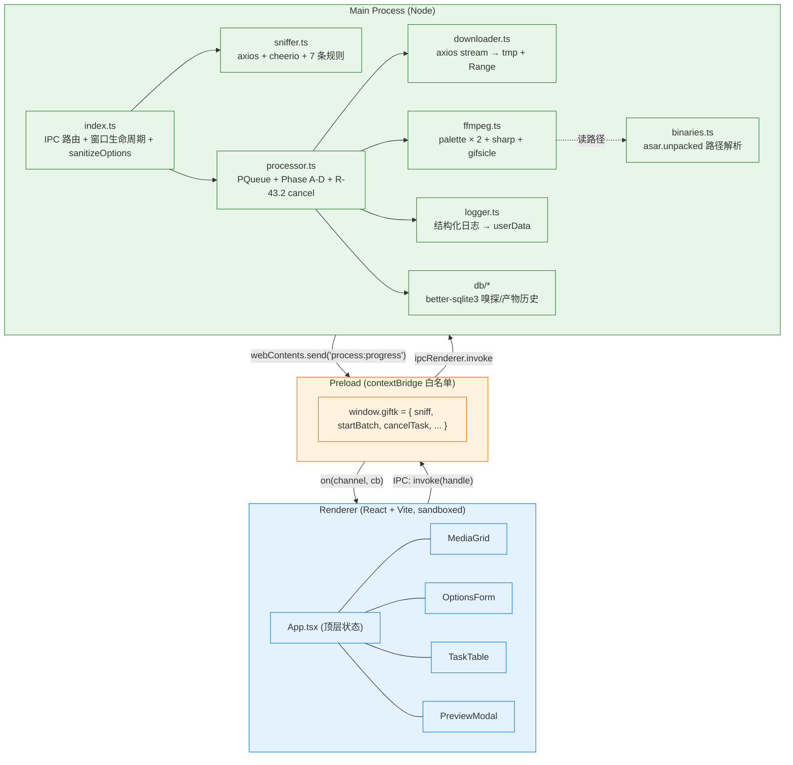
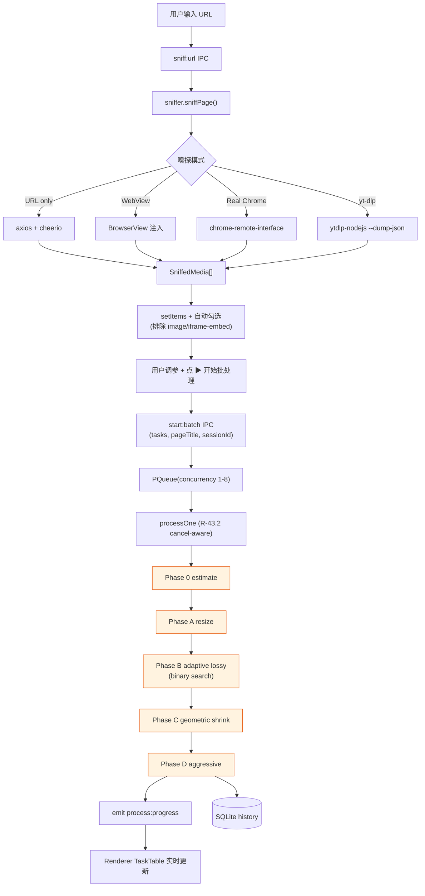
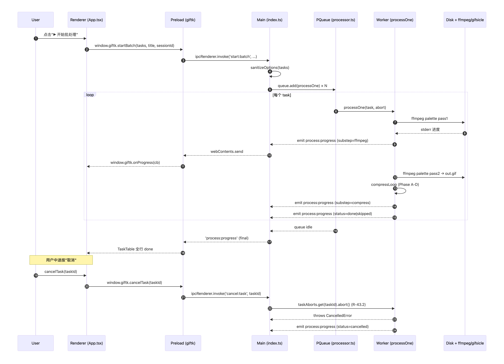
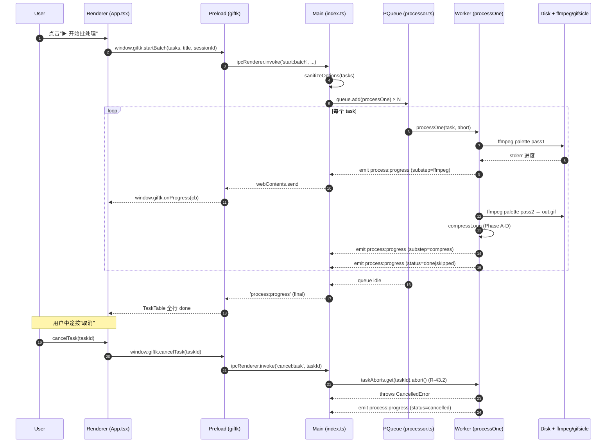
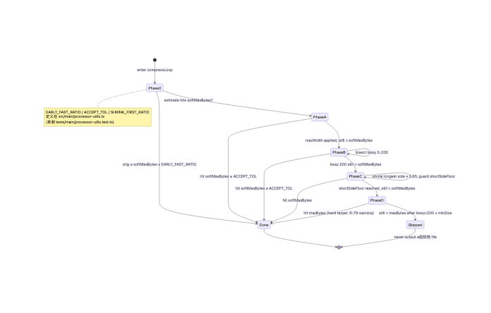
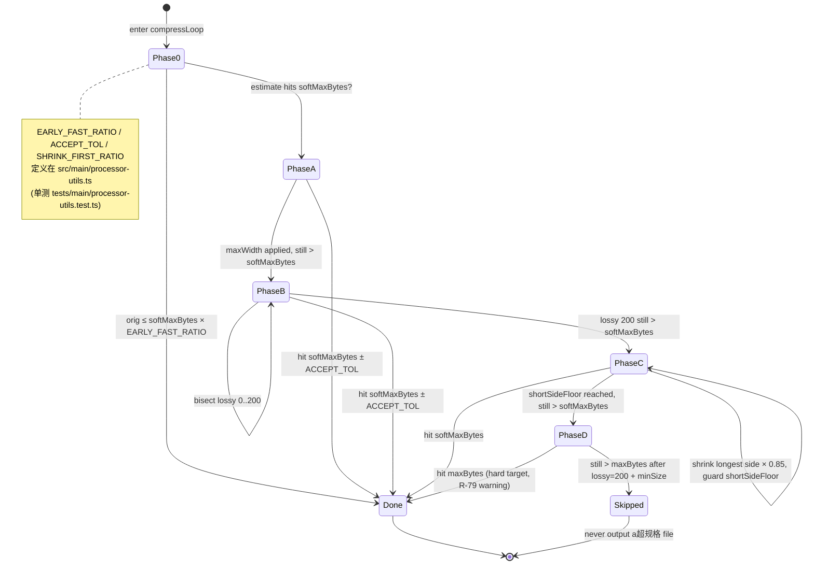
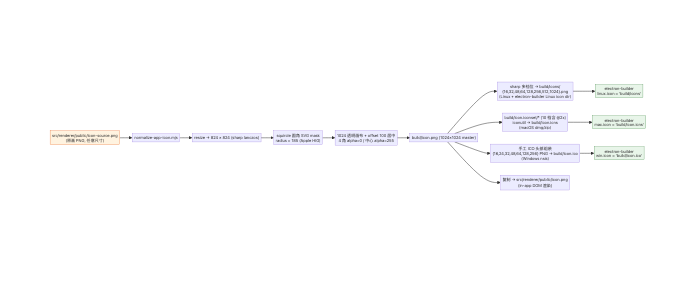
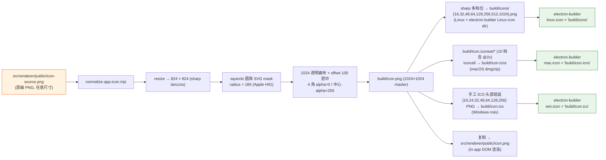
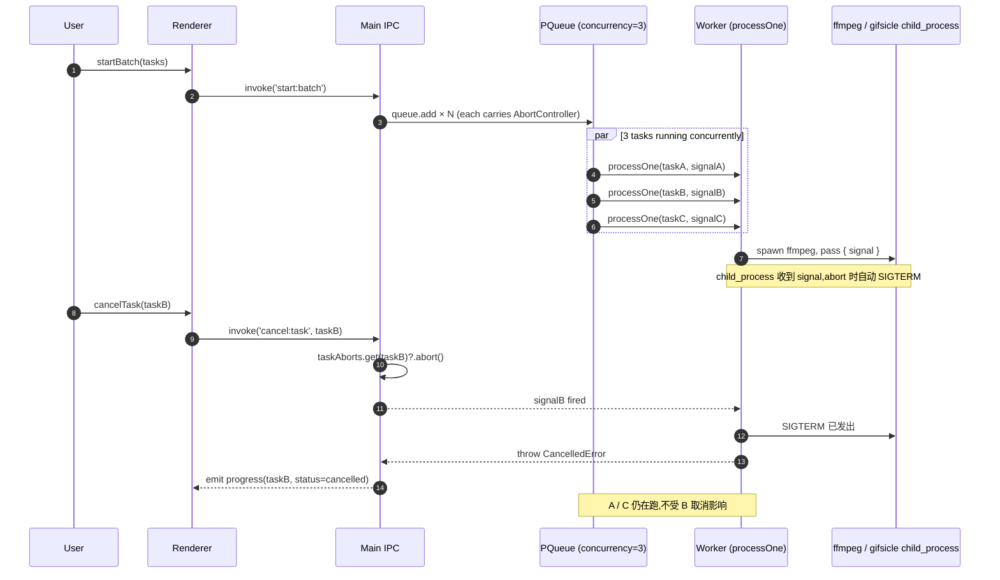

# docs/architecture.md

> 三段式 Electron:**Renderer(只渲染) → Preload(白名单桥) → Main(所有重活)**。
> 配套规则:[AGENTS.md R-01 / R-10 / R-11](file:///Users/guoshuyu/workspace/gif-toolkit/AGENTS.md)。
> 配套规格:[project_rules.md §7](file:///Users/guoshuyu/workspace/gif-toolkit/project_rules.md) 「何时不该拆 / processor.ts 真实业务复杂度豁免」。

> **图片是 [scripts/render-mermaid.mjs](file:///Users/guoshuyu/workspace/gif-toolkit/scripts/render-mermaid.mjs) 把本文中 mermaid 块渲染出来的，源始终以本文 mermaid 为准；改完源运行 `npm run docs:render` 重新出图。**

---

## 1. 进程拓扑

---

## 2. 不变量(Invariants)

| 不变量 | 违反后果 |
|---|---|
| Renderer 不直接调 `child_process` / `fs` | Electron 安全基线塌方 |
| 共享类型只放 [src/shared/types/](file:///Users/guoshuyu/workspace/gif-toolkit/src/shared/types) | 主/渲两边 schema 漂移,运行期才发现 |
| 二进制路径只通过 [src/main/binaries.ts](file:///Users/guoshuyu/workspace/gif-toolkit/src/main/binaries.ts) | 打包后 ffmpeg 找不到 |
| `sniff:url` 拒绝 `file://` / `javascript:` | 任意文件读 + XSS 风险 |
| Preload 暴露的方法必须 + global.d.ts 一起改 | 生产构建 `window.giftk.foo` undefined |
| [processor.ts](file:///Users/guoshuyu/workspace/gif-toolkit/src/main/processor.ts) 不强行拆模块（≈ 3200 行豁免） | 见 [project_rules.md §7](file:///Users/guoshuyu/workspace/gif-toolkit/project_rules.md) — 真实业务复杂度，不是设计债 |

---

## 3. 主进程文件分工

| 文件 | 职责 | 关键 export |
|---|---|---|
| [index.ts](file:///Users/guoshuyu/workspace/gif-toolkit/src/main/index.ts) | 应用入口、`BrowserWindow`、注册 IPC handlers、`sanitizeOptions` | `app.whenReady` |
| [binaries.ts](file:///Users/guoshuyu/workspace/gif-toolkit/src/main/binaries.ts) | 解析 ffmpeg/ffprobe/gifsicle 路径(asar.unpacked 修正) | `getFFmpegPath / getGifsiclePath` |
| [sniffer.ts](file:///Users/guoshuyu/workspace/gif-toolkit/src/main/sniffer.ts) | 7 条嗅探规则 + dedupKey + matchEmbedProvider | `sniffPage` |
| [downloader.ts](file:///Users/guoshuyu/workspace/gif-toolkit/src/main/downloader.ts) | 流式下载 + Range + Content-Length | `downloadToTmp` |
| [ffmpeg.ts](file:///Users/guoshuyu/workspace/gif-toolkit/src/main/ffmpeg.ts) | palette 两遍 + sharp 缩放 + gifsicle 优化 | `videoToGif / gifResize / gifOptimize` |
| [processor.ts](file:///Users/guoshuyu/workspace/gif-toolkit/src/main/processor.ts) | 任务调度(pqueue) + Phase A-D 压缩 + AspectRatioConstraintError | `processOne / startBatch` |
| [processor-utils.ts](file:///Users/guoshuyu/workspace/gif-toolkit/src/main/processor-utils.ts) | 纯函数：clampConcurrency / shortSideAfterCap / compressCacheKey / chooseCompressionTargetMB / ACCEPT_TOL 等可单测的常量与算法 | 见 [tests/main/processor-utils.test.ts](file:///Users/guoshuyu/workspace/gif-toolkit/tests/main/processor-utils.test.ts) |
| [logger.ts](file:///Users/guoshuyu/workspace/gif-toolkit/src/main/logger.ts) | 结构化日志(写到 userData) | `logger` |

---

## 4. Renderer 主要组件

| 组件 | 职责 |
|---|---|
| [App.tsx](file:///Users/guoshuyu/workspace/gif-toolkit/src/renderer/App.tsx) | 顶层状态(items / selected / progress / processingOne) + 启动批处理 + 单条处理 |
| [MediaGrid.tsx](file:///Users/guoshuyu/workspace/gif-toolkit/src/renderer/components/MediaGrid.tsx) | 网格预览 + 卡片"处理此项" + iframe-embed 黄色徽章 |
| [PreviewModal.tsx](file:///Users/guoshuyu/workspace/gif-toolkit/src/renderer/components/PreviewModal.tsx) | 大图弹窗 + 裁剪/时间轴/帧 tab |
| [OptionsForm.tsx](file:///Users/guoshuyu/workspace/gif-toolkit/src/renderer/components/OptionsForm.tsx) | 最佳目标/降级上限/最长边/并发 输入,soft↔hard 互相 clamp |
| [TaskTable.tsx](file:///Users/guoshuyu/workspace/gif-toolkit/src/renderer/components/TaskTable.tsx) | 进度行(substep / detail / elapsedMs / 阶段名) |

---

## 5. 数据流(端到端)

---

## 6. IPC 调用链 — `start:batch` 序列

---

## 7. 4-Phase 压缩状态机

---

## 8. 跨平台 App Icon 资产链路

dock / taskbar / launcher 上 App 图标看起来比别人大,根因在于其它 App 都遵循 Apple HIG 的 **824 / 1024 安全区**:1024 画布里只有中心 824×824 正方形是有像素的,四周 100px 透明 padding;系统会按 padding 把图标在 dock 等位置缩放对齐。直接用 1024 全铺的 PNG 当 icon,等同于"别人 824 我 1024",视觉上自然偏大。

[scripts/normalize-app-icon.mjs](file:///Users/guoshuyu/workspace/gif-toolkit/scripts/normalize-app-icon.mjs) 是这条修正的唯一入口:

零新增 npm 依赖:复用已经在 dependencies 里的 sharp、macOS 自带的 iconutil、纯 Node fs 手工拼 ICO 头(ICONDIR 6 字节 + ICONDIRENTRY 16 字节 × n + PNG 数据)。

---

## 9. 并发与取消传播

[processor.ts](file:///Users/guoshuyu/workspace/gif-toolkit/src/main/processor.ts) 用 [p-queue](https://github.com/sindresorhus/p-queue) 做并发,默认 concurrency=3(R-07 上限 8)。每个 task 在调度时分到一对 `(taskId, AbortController)`,存进 `taskAborts: Map<string, AbortController>`,signal 沿三层往下贯穿:

关键不变量:
- 一个 task 的 abort 只杀**它自己的** ffmpeg/gifsicle 子进程,**不影响**同 batch 其它并发 task(R-43.2)
- queue 跑空后 `taskAborts` 清空,防止内存泄漏
- 渲染端收到 `status=cancelled` 直接打 chip,不再期望后续 progress(R-26)

