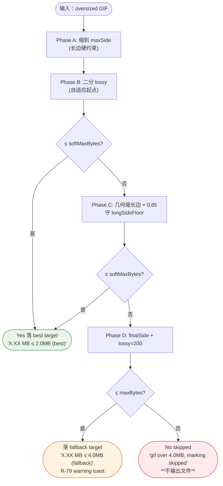
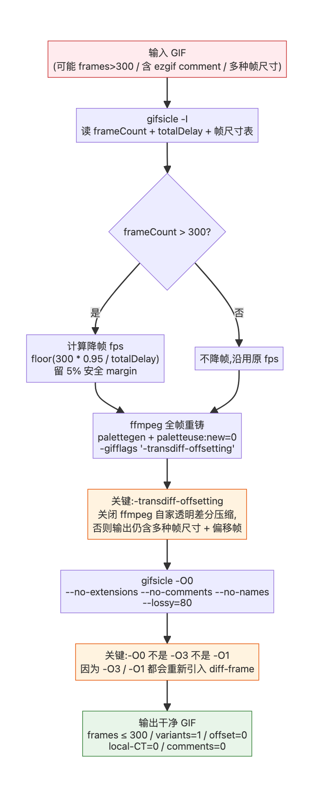
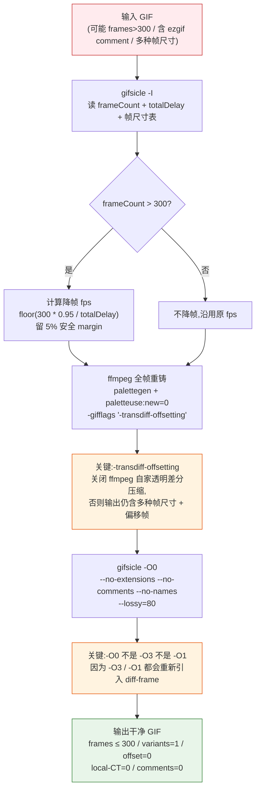

# docs/compression-pipeline.md

> Phase A/B/C/D 的设计目的、入口/出口条件、关键不变量。
> 源代码:[src/main/processor.ts](file:///Users/guoshuyu/workspace/gif-toolkit/src/main/processor.ts) `compressLoop`。
> 关联规则:[R-03](file:///Users/guoshuyu/workspace/gif-toolkit/AGENTS.md) / [R-04](file:///Users/guoshuyu/workspace/gif-toolkit/AGENTS.md) / [R-05](file:///Users/guoshuyu/workspace/gif-toolkit/AGENTS.md) / [R-06](file:///Users/guoshuyu/workspace/gif-toolkit/AGENTS.md)。

---

## 1. 双层目标(R-05)




UI 上 `softMaxBytes ≤ maxBytes` 互相 clamp,见 [OptionsForm.tsx](file:///Users/guoshuyu/workspace/gif-toolkit/src/renderer/components/OptionsForm.tsx)。

---

## 2. Phase A — Resize-first(R-03)

**目的**:在压缩前先满足"长边 ≤ maxSide"硬约束。

```
longestSide = max(width, height)
shortestSide = min(width, height)
if (longestSide <= maxSide) skip Phase A;
else cap = maxSide
     newShort = round(shortestSide * cap / longestSide)
     if (newShort < minSide) throw AspectRatioConstraintError(...)
     resize to (cap on long side, newShort on short side)
```

**早 fail**(R-06):若按 maxSide 缩之后短边会 < minSide(典型场景:9:1 长条图 + minSide=240),**直接抛异常**,UI 把这条任务标 skipped。绝不能压扁出畸变图。

---

## 3. Phase B — Adaptive lossy 二分(R-04)

**目的**:在不动尺寸的前提下,用 gifsicle `--lossy` 把体积压到 softMaxBytes。

**关键设计**:

1. **自适应起点 startLossy**:根据 currentSize/softTarget 比值取
   ```
   ratio < 1.2 → startLossy = 30
   ratio < 1.6 → startLossy = 60
   ratio < 2.2 → startLossy = 90
   ratio < 3.0 → startLossy = 120
   ratio < 4.5 → startLossy = 150
   ratio ≥ 4.5 → startLossy = 180
   ```
   不像最早那样从 0 一路跑到 200(245 次穷举),现在 ~12 次以内基本收敛。
2. **二分搜索**:`lo=0`,`hi=startLossy*2`,每次取 mid 调 gifsicle,根据是否达标更新区间。
3. **Phase B 内只动 lossy,不动尺寸/帧率**。

---

## 4. Phase C — 几何缩边 + longSideFloor(R-06)

**目的**:Phase B 没把体积压到 softMax 时,**等比缩长边**(每次 ×0.85),并保证短边 ≥ minSide。

**关键不变量(longSideFloor 推导)**:

```
fromShort = ceil(longestSide * minSide / shortestSide)
longSideFloor = max(minSide, min(longestSide, fromShort))
```

意思:"长边最少缩到多少,才能让短边恰好不破 minSide"。**Phase C 缩到 longSideFloor 就停**,不能更小。
源代码:[longSideFloor 推导](file:///Users/guoshuyu/workspace/gif-toolkit/src/main/processor.ts#L391-L401)。

---

## 5. Phase D — 终极兜底

**目的**:Phase C 没把体积压到 maxBytes(fallback)时,直接用 `finalSide=longSideFloor` + 最大 lossy(180/200) 再来一次。

**出口条件**:

- 命中 `<= maxBytes` → emit "gif saved (X MB <= 4.0MB (fallback))"
- 仍 > maxBytes → emit "gif over 4.0MB, marking skipped",**不输出文件**

---

## 6. emit 信号(给 UI / 日志)

| 信号 | 意义 |
|---|---|
| `gif saved (X.XX MB <= 2.0MB (best))` | Phase A→B 命中 best |
| `gif saved (X.XX MB <= 4.0MB (fallback))` | Phase C/D 命中 fallback |
| `gif over 4.0MB, marking skipped` | Phase D 仍超,跳过 |
| `AspectRatioConstraintError: ...` | Phase A 早 fail |

---

## 7. 改动这条管线时的检查清单

- [ ] 新阶段是否依然保证短边 ≥ minSide?
- [ ] 新阶段是否依然先尝试 softMax,失败再降级到 maxBytes?
- [ ] 是否给 emit 加了对应的 substep / detail / elapsedMs(R-08)?
- [ ] 是否给 [harness/scenarios/](file:///Users/guoshuyu/workspace/gif-toolkit/harness/scenarios/) 增加了对应回归场景?
- [ ] [SC-02 aspect-ratio](file:///Users/guoshuyu/workspace/gif-toolkit/harness/scenarios/SC-02-aspect-ratio-early-fail.md) 是否仍然按预期 fail?
- [ ] [SC-03 soft-vs-hard](file:///Users/guoshuyu/workspace/gif-toolkit/harness/scenarios/SC-03-soft-vs-hard-target.md) 是否仍然按预期分级?

---

## 8. WeChat-safe sanitize 子流程

公众号编辑器会因两条独立硬限同时触发"图片载入失败 / 来源信息无法识别":

1. **帧数 ≤ 300**(超过则直接拒绝插入)
2. **header 干净**:不能有非标 `application extension` / `comment` / **diff-frame**(transparent diff + offset frame)— 任意一条命中,公众号 CDN 会拒识别

普通 `gifsicle -O3` 反而会**把 diff-frame 加回来**(逐帧只编码差分块)。所以我们走一条独立的 **三步法 sanitize 子管线**,作为 [GIF Optimize](file:///Users/guoshuyu/workspace/gif-toolkit/src/main/ffmpeg.ts) 工具的 `wechat-safe` method 暴露给 UI,也可作为 [scripts/sanitize-gif.mjs](file:///Users/guoshuyu/workspace/gif-toolkit/scripts/sanitize-gif.mjs) 离线 CLI 跑:





判定 GIF 是否需要走这条管线,由 [scripts/diagnose-gif.mjs](file:///Users/guoshuyu/workspace/gif-toolkit/scripts/diagnose-gif.mjs) 给出 9 类 finding:

| Finding | 严重度 | 触发条件 |
|---|---|---|
| FRAMES_OVER_300 | high | 帧数 > 300(公众号必拒) |
| FRAMES_NEAR_300 | mid | 290 ≤ 帧数 ≤ 300(留 margin) |
| COMMENT_BLOCK | high | 含 comment block(如 ezgif 水印) |
| DIFF_FRAMES | mid | 多种帧尺寸 / 偏移帧(diff-frame 压缩) |
| LOCAL_CT_PLUS_TRANSP | mid | 含 local color table 且有透明帧 |
| TOO_LARGE_WECHAT | mid | > 5 MB(公众号经验上限) |
| TOO_LARGE_5MB | low | > 5 MB(其它平台经验上限) |
| OVERSIZE_DIM | low | 任意边 > 1280 px |
| LONG_RECORDING | low | 总时长 > 60 s |

只要任一 high 或 mid finding 命中,就必须走 wechat-safe 子管线;low finding 用户决定。

